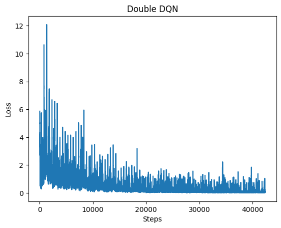
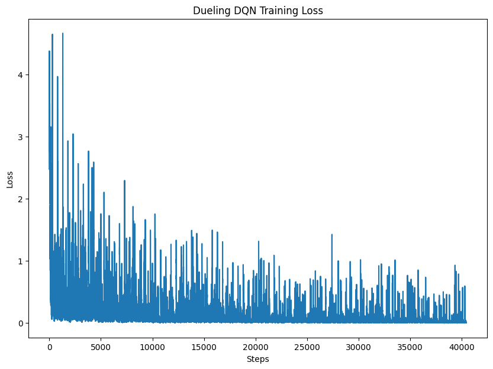

# 💡 如何改進基本的 DQN 方法：Double DQN 與 Dueling DQN

強化學習中，DQN（Deep Q-Network）結合了深度神經網路與 Q-learning，讓智能體能在高維度狀態空間中進行決策。然而，基本 DQN 仍有兩大缺陷：

---

## ❗ 基本 DQN 的問題

1. **Q 值高估（Overestimation Bias）**基本 DQN 同時用同一個網路決定最大 Q 值的動作和估計該動作的 Q 值，容易導致錯誤放大，學習不穩定。
2. **無法有效建模狀態價值（Inefficient Learning）**
   在某些狀態下，選擇哪個動作其實沒差，但 DQN 對每個 `(s, a)` 配對都單獨學習，效率低下。

---

## 🧠 改進一：Double DQN

### 🎯 核心概念

將「選擇動作」與「估計 Q 值」分開：

- **Online Network**：選擇最佳動作（`argmax`）
- **Target Network**：評估該動作的 Q 值

這樣可降低高估偏差，提升收斂穩定性。

### 📌 Q 值更新公式：

```
Q(s, a) = r + γ * Q_target(s', argmax_a' Q_online(s', a'))
```

### 🔍 程式碼說明片段

```python
with torch.no_grad():
    q_online = model(state2_batch)           # Online 網路：決定動作
    q_target = target_model(state2_batch)    # Target 網路：估計該動作的 Q 值
    next_actions = q_online.argmax(dim=1, keepdim=True)
    Q2 = q_target.gather(1, next_actions).squeeze()
```

這段中，`model` 用來選出最大值動作索引，而 `target_model` 對這些動作估算 Q 值。

---

## 🧠 改進二：Dueling DQN

### 🎯 核心概念

拆解 Q 值為兩部分：

- **V(s)**：狀態本身的價值（不依賴動作）
- **A(s,a)**：動作的相對優勢（代表此動作好壞）

### 📌 合成公式：

```
Q(s,a) = V(s) + A(s,a) - mean(A(s,·))
```

### 🔍 模型架構程式碼：

```python
class DuelingQNetwork(nn.Module):
    def __init__(self):
        super().__init__()
        self.feature = nn.Sequential(
            nn.Linear(64, 150), nn.ReLU()
        )
        self.value_stream = nn.Sequential(
            nn.Linear(150, 100), nn.ReLU(), nn.Linear(100, 1)
        )
        self.advantage_stream = nn.Sequential(
            nn.Linear(150, 100), nn.ReLU(), nn.Linear(100, 4)
        )

    def forward(self, x):
        x = self.feature(x)
        v = self.value_stream(x)
        a = self.advantage_stream(x)
        return v + a - a.mean(dim=1, keepdim=True)
```

Dueling 架構適合「某些動作幾乎無差異」的環境，如在牆角站著的場景，能提升訓練效率。

---

## 📊 方法比較

| 方法        | 改進重點               | 解決問題             | 是否增加網路複雜度 |
| ----------- | ---------------------- | -------------------- | ------------------ |
| Double DQN  | 分離選擇與估值         | Q 值高估             | 否（需雙網路）     |
| Dueling DQN | 拆分狀態價值與動作優勢 | 學習效率差、動作冗餘 | 是（改架構）       |

---

## ✅ 總結

透過 Double DQN 與 Dueling DQN，能從「Q 值估計誤差」與「學習效率」兩方面提升基本 DQN，讓強化學習模型在訓練穩定性與泛化能力上更上一層樓。

---

## 🧪 Double DQN 程式碼說明

以下為 Double DQN 在 GridWorld 環境中的實作關鍵：

```python
class QNetwork(nn.Module):
    def __init__(self):
        ...
        self.fc1 = nn.Linear(64, 150)
        self.fc2 = nn.Linear(150, 100)
        self.fc3 = nn.Linear(100, 4)

    def forward(self, x):
        x = F.relu(self.fc1(x))
        x = F.relu(self.fc2(x))
        return self.fc3(x)
```

- 使用單一 Q 值輸出，每個動作對應一個輸出維度。
- Replay Buffer 儲存經驗，並使用 `model` 做策略選擇，`target_model` 做 Q 值評估。

核心更新段落：

```python
with torch.no_grad():
    online = model(s2)
    target = target_model(s2)
    a_prime = online.argmax(dim=1, keepdim=True)
    q2 = target.gather(1, a_prime).squeeze()
```

這裡就是 **Double DQN 的核心機制**：用 `online` 選動作，用 `target` 評估該動作的價值。

---

## 🧪 Dueling DQN 程式碼說明

以下為 Dueling DQN 的 PyTorch 模型：

```python
class DuelingQNetwork(nn.Module):
    def __init__(self):
        ...
        self.feature = nn.Sequential(nn.Linear(64, 150), nn.ReLU())
        self.value_stream = nn.Sequential(nn.Linear(150, 100), nn.ReLU(), nn.Linear(100, 1))
        self.advantage_stream = nn.Sequential(nn.Linear(150, 100), nn.ReLU(), nn.Linear(100, 4))

    def forward(self, x):
        x = self.feature(x)
        v = self.value_stream(x)
        a = self.advantage_stream(x)
        return v + a - a.mean(dim=1, keepdim=True)
```

- `feature` 層負責提取狀態特徵。
- `value_stream` 輸出狀態價值 V(s)。
- `advantage_stream` 輸出動作優勢 A(s, a)。
- 最終合併為 Q 值。

Q 值計算邏輯：

```python
return v + a - a.mean(dim=1, keepdim=True)
```

這種架構有助於在某些動作差異不大的狀態中仍能有效學習狀態價值，提升收斂速度。

---

## 🧪 視覺化結果

訓練結束後，兩個模型皆繪製 loss 收斂曲線：

```python
plt.plot(losses)
plt.xlabel("Steps")
plt.ylabel("Loss")
plt.title("Double DQN / Dueling DQN Training Loss")
```

這可用來比較不同架構在學習過程中的穩定性與收斂速度。

### Double DQN結果



### Double DQN結果


