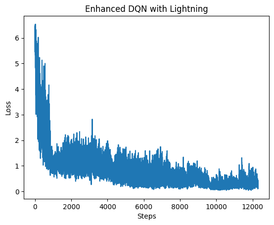

# 🧠 強化學習 DQN 模型：PyTorch → PyTorch Lightning 轉換與訓練技巧強化

本範例展示如何將原始的 PyTorch DQN 模型轉換為 PyTorch Lightning 架構，並整合數種訓練穩定技巧來改善學習表現，包括：

- Soft Update
- Reward Normalization
- Learning Rate Warm-up (`LambdaLR`)
- Gradient Clipping
- Target Network + Replay Buffer

---

## 📦 模型結構：QNetwork

```python
class QNetwork(nn.Module):
    def __init__(self):
        super().__init__()
        self.fc1 = nn.Linear(64, 150)
        self.fc2 = nn.Linear(150, 100)
        self.fc3 = nn.Linear(100, 4)
```

- 輸入為 64 維的狀態向量（flatten 過的 4x4x4）
- 輸出為四個動作的 Q 值：上、下、左、右

---

## ⚡ PyTorch Lightning 改寫與邏輯分離

### 模組封裝

```python
class DQNLightning(pl.LightningModule):
```

- 將訓練邏輯封裝進 `training_step` 與 `train_episode`
- 支援 `soft_update` 與 `replay memory` 的實作

### 訓練技巧一覽

| 技巧名稱              | 實作內容                                          | 作用                 |
| --------------------- | ------------------------------------------------- | -------------------- |
| Soft Update           | `target_param = τ * current + (1-τ) * target` | 穩定目標網路參數更新 |
| Reward Normalization  | recent 100 回合計算 mean/std                      | 防止極端值干擾訓練   |
| Learning Rate Warm-up | `LambdaLR(step / 500)`                          | 防止初期震盪         |
| Gradient Clipping     | `clip_grad_norm_(model, max_norm=5.0)`          | 防止梯度爆炸         |
| Epsilon Decay         | 線性衰減至 0.1                                    | 漸進收斂策略選擇     |

---

## 🧠 Training Step

```python
def training_step(self, batch, batch_idx):
    for _ in range(5):
        self.train_episode()
```

- 每個 Lightning step 執行多個 environment interaction
- 搭配 dummy dataloader 繞過必須依賴 Dataset 的限制

---

## 🎯 學習與同步更新

```python
def learn_from_batch(self, batch):
    q1 = self.model(state)
    q2 = self.target_model(next_state)
    y = r + γ * (1 - done) * max(q2)
```

- 標準 Q-learning 損失函數
- 實作梯度削減（clipping）與 optimizer.step()

---

## 📊 訓練過程視覺化

```python
plt.plot(dqn_agent.losses)
plt.title("Enhanced DQN with Lightning")
```

可觀察 loss 隨著訓練趨勢收斂



---

## ✅ 總結

本範例成功將 DQN 模型轉為 PyTorch Lightning，並強化訓練流程，具有以下優勢：

- 🌱 更乾淨的訓練邏輯分離（OOP 結構）
- ⚙️ 自動管理 optimizer、scheduler 與 logging
- ✅ 可整合 EarlyStopping、Checkpoint 等 Lightning 功能

> 適合未來整合進大型強化學習框架或分布式訓練流程中。
